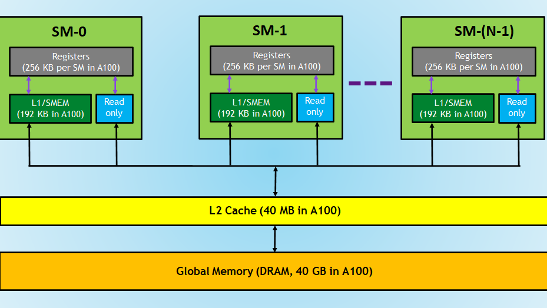

# Understanding Memory

- **Global Memory:** Largest, high-latency, accessible by all threads and CPU, holds large datasets.
- **Shared Memory:** On-chip, fast, limited size, shared within thread block, useful for collaboration.
- **Registers (Local Memory):** Per-thread, fastest, very limited in size, used for local variables (spills to global if overused).

## global memory coalescing

threads are grouped in warps. memory accessess by threads in the same warp can be grouped and executed as one if:

- the threads are sequential in memory
- the threads are accessing consecutive memory locations

row-major!

## shared memory

Next to the large global memory, a GPU has a much smaller region of memory that is physically located on the chip, called shared memory (SMEM). Physically, there’s one shared memory per SM. Logically, this shared memory is partitioned among the blocks. This means that a thread can communicate with the other threads in its block via the shared memory chunk. As the shared memory is located on-chip, it has a much lower latency and higher bandwidth than global memory.