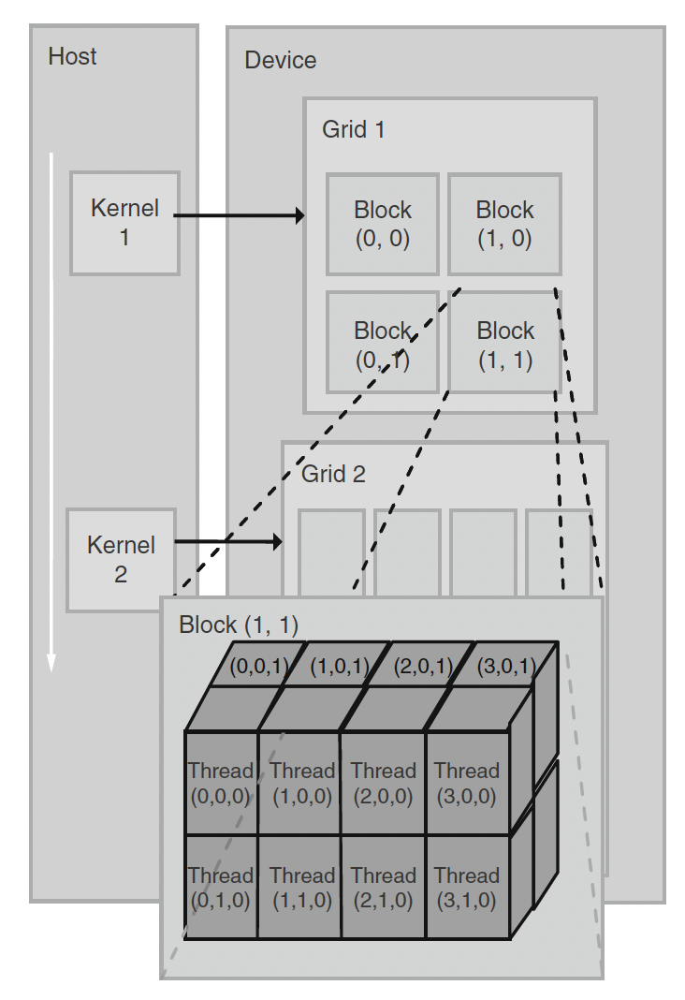

# Threads in CUDA

When you launch a CUDA kernel, you’re actually creating a grid of threads, and every single one executes the same kernel function in parallel.

## Grid and Block Structure

- A grid is typically organized as a 2D array of blocks.
- Each block is a 3D array of threads.
- The execution configuration you specify at launch (e.g., <<<numBlocks, threadsPerBlock>>>) determines how the grid is structured.
- Each block can contain up to 1024 threads (hardware-dependent limit).



## Thread Identification

Each thread and block is assigned unique built-in coordinates:

- `blockIdx` → identifies the block within the grid
- `threadIdx` → identifies the thread within the block

Using these indices, threads can compute their global thread ID and determine which portion of data they are responsible for processing.

```
int globalIdx = blockIdx.x * blockDim.x + threadIdx.x;
```

It’s up to the programmer to use these indices correctly for proper parallel data mapping.

## Synchronization and Memory

Threads within the same block can:

- Synchronize using `__syncthreads()`
- Share data efficiently through shared memory, which is much faster than global memory

Threads in different blocks cannot synchronize directly. Coordination between blocks must be handled through global memory or multiple kernel launches.

## Tip

Efficient CUDA programming often comes down to:

- Designing your grid/block layout to match your data structure
- Using shared memory to minimize slow global memory accesses
- Ensuring no data races occur during synchronization
